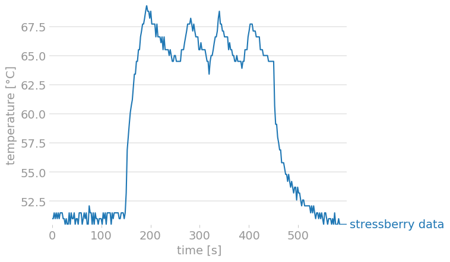

# go-rpifancon
A simple temperature based fan controller for a raspberry pi in go.

## Usage
```
  -checks int
         The number of checks of temperatures to check before state changes. (default 3)
  -debug
         Debug info.
  -help
         This info.
  -iopin int
         The GPIO pin used to control the fan. (default 17)
  -threshold int
         The temperature in celius above which to enable the fan. (default 65)
  -wait int
         The amount of time to wait between polling temperature. Multiply this by checks to get time between pin state changes. (default 5)
```

## Systemd
I run it with a little systemd service like so: 
```
[Unit]
Description=RPi Fan control

[Service]
Type=simple
ExecStart=/usr/local/rpifancon
Restart=always

[Install]
WantedBy=multi-user.target
```

## Charts
Seems to work ok. At least it stops my test pi 3 throttling. Without fan:

With fan:
